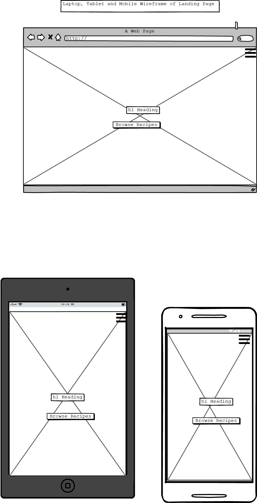
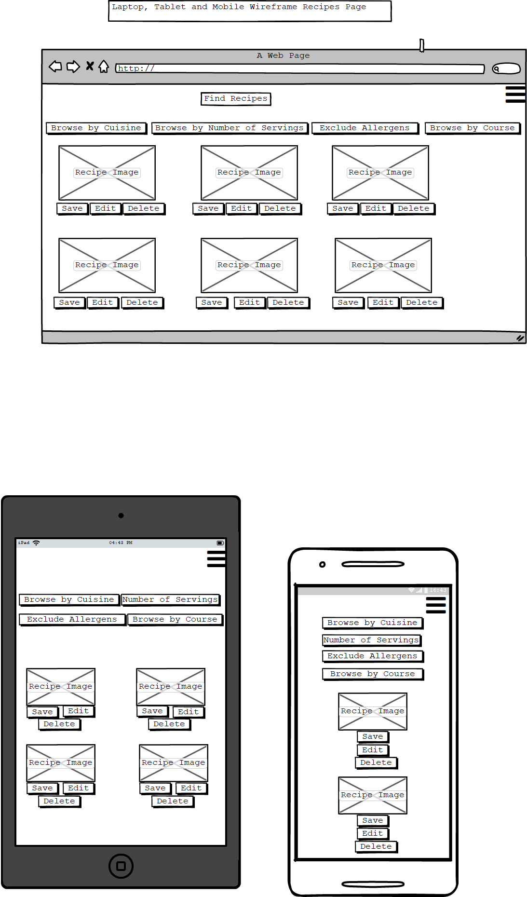
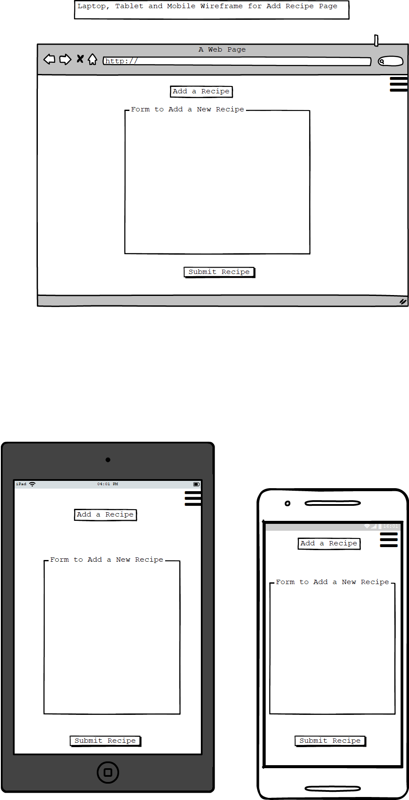
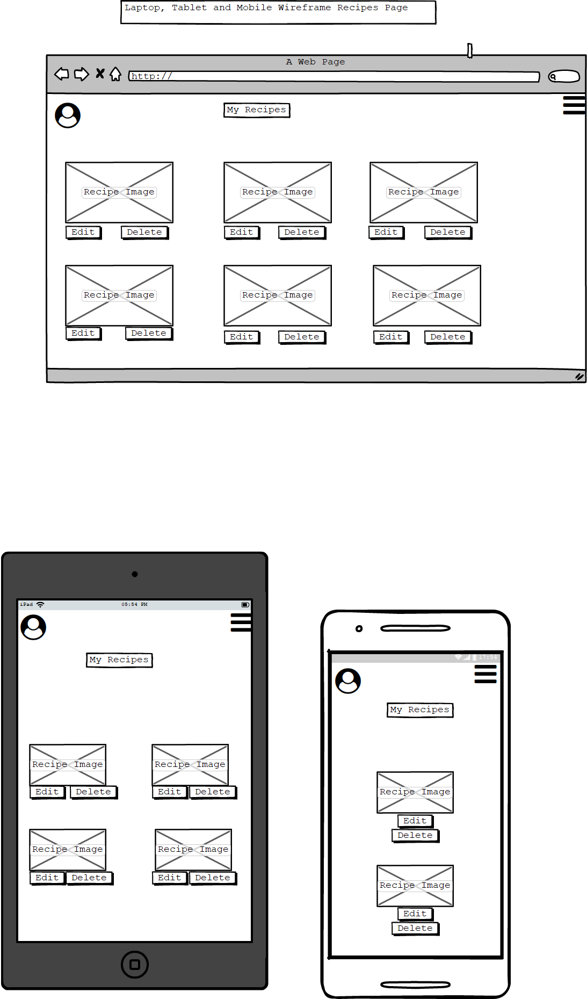

# Online Cookbook App Milestone 3

#### User Stories
* As a user I want to visit this site so that I can search for recipes that do not contain ingredients I am allergic to.
* As a user I want to visit this site so I can add and store my own recipes and keep them in one place.
* As foodie I want to visit this site so that I can filter recipes based on different types of cuisine. 
* As a keen baker I want to visit this site so that I can search for, store and edit various recipes.
 

#### Wireframes
* Landing Page 
* Browse Recipes 
* Add Recipe 
* User Profile 

#### Database Schema
* Schema Outline 

##### Example Recipe Schema
{  
        _id:ObjectId("5c8ec1751c9d4400002eae5f2)  
        recipe_name:"Aubergine and mozzarella bake ",  
        image_url:"https://ichef.bbci.co.uk/food/ic/food_16x9_832/recipes/aubergine_and_mozzarella_51464_16x9.jpg,  
        author:"Antonio Carluccio",     
        course:"Main",  
        cuisine_name:"Italian",  
        servings:4,  
        ingredients:  
            [  
                0:"3 tbsp olive oil"  
                1:"3 garlic cloves, crushed "  
                2:"2 x 400g/14oz tins chopped tomatoes"  
                3:"salt and pepper"  
                4:"2 medium to large aubergines"  
                5:"1 ball mozzarella, drained and torn into pieces"  
            ]    
        Method:  
            [  
                0:"Preheat the oven to 200C/400F/Gas 6."  
                1:"Heat a saucepan over a medium heat. Add one tablespoon of the olive oil and, once hot, add the onion and a pinch of salt. Fry the onion for 4-5 minutes, or until softened. Add the garlic and continue to cook for two minutes."  
                2:"Pour in the tomatoes and mix well, breaking up any larger bits with the back of your spoon.     Season with a pinch of salt and pepper and bring to a simmer. Reduce the heat and simmer         gently for 20-30 minutes, or until the tomato sauce is thickened and flavoursome."  
                3:"Meanwhile slice the aubergines lengthways into slices 5mm/¼in thick. Brush the aubergine slices with olive oil and season well with salt and pepper on both sides. Heat a griddle pan until smoking hot and then griddle in batches for 2-3 minutes on each side, or until all the slices are  golden brown. Alternatively, heat the grill to high, place half of the aubergine slices on a baking tray and grill for 3-4 minutes on each side. Continue with the rest of the slices until they are all golden-brown. Remove and leave to one side once cooked"  
                4:"Add a spoonful of tomato sauce to the bottom of a medium sized ovenproof baking dish (about      28x22cm/11x8½in)and spread evenly. Top with a third of the aubergine slices."  
                5:"Follow with a third of the remaining tomato sauce and top with a third of the mozzarella.        Repeat the process for another two layers finishing with tomato sauce and the mozzarella.     Place into the preheated oven and bake for 25-30 minutes, or until the dish is bubbling and     the mozzarella melted and golden-brown on top"  
        ]  
    }
    
##### Example Cuisine Schema
    {  
        _id: ObjectId("5c8d0f7f1c9d4400004b5187")  
        cuisine_name:"American"  
    }

##### Example Course Schema
    {     
        _id: ObjectId("5c9001751c9d4400007fae6c")  
        course:"Main"  
    }

