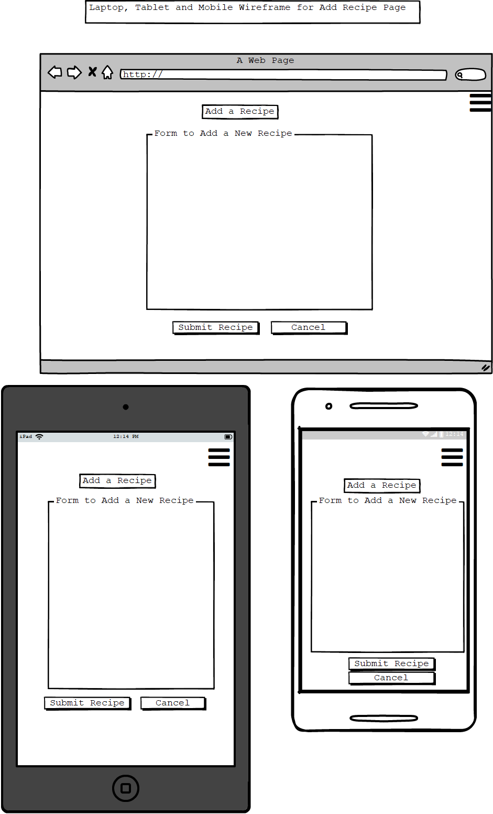

# Online Cookbook App Milestone 3
This project was created as an End of Module Project for the Code Institute's Data Centric Development Module. I chose to follow the example brief and create an online cookbook. I decided to focus on dinner options from around the world. A user can select a starter, main course or desert from a variety of cuisines.

## UX
This is site was designed to allow users to view, edit and add new reipces. The recipes are grouped by cuisine type and within that by course name. It is also possible to find recipes that exclude specific allergens. 

#### User Stories
* As a user I want to visit this site so that I can search for recipes that do not contain ingredients I am allergic to.
* As a user I want to visit this site to give me some ideas for a dinner party I am throwing.
* As a foodie. I want to visit this site so that I can filter recipes based on different types of cuisine. 
* As a keen baker I want to visit this site so that I can search for, add and edit various recipes.

#### Wireframes
* Browse Recipes 
* Add Recipe 
* Display Recipe 
* Edit Recipe 

#### Database Schema
* Updated Schema 
 
User registration removed from final version of database schema.

##### Example from Recipes Collection
    {
        _id:ObjectId("5c8ec1751c9d4400002eae5f")
        recipe_name: "Aubergine and mozzarella bake"
        image_url: "https://ichef.bbci.co.uk/food/ic/food_16x9_832/recipes/aubergine_and_mozzarella_51464_16x9.jpg"
        author: "Antonio Carluccio"
        course_name: "Main"
        cuisine_name: "Italian"
        servings: 4
        prep_time: "less than 30mins"
        cook_time: "30 mins to 1 hour"
        allergens: Array
                        0 :"dairy"
        ingredients: Array
                        0: 3 tbsp olive oil
                        1: 3 garlic cloves, crushed
                        2: 2 x 400g tin chopped tomatoes
                        3: salt and pepper
                        4: 2 medium to large aubergines
                        5: 1 ball mozzarella, drained and torn into pieces
                        
        instructions:   Preheat the oven to 200C/400F/Gas 6. Heat a saucepan over a medium heat. Add one tablespoon of                  the olive oil and, once hot, add the onion and a pinch of salt. Fry the onion for 4-5 minutes,                  or until softened. Add the garlic and continue to cook for two minutes. Pour in the tomatoes and                 mix well, breaking up any larger bits with the back of your spoon. Season with a pinch of salt                  and pepper and bring to a simmer. Reduce the heat and simmer gently for 20-30 minutes, or until                 the tomato sauce is thickened and flavoursome. Meanwhile slice the aubergines lengthways into                   slices 5mm/¼in thick. Brush the aubergine slices with olive oil and season well with salt and                   pepper on both sides. Heat a griddle pan until smoking hot and then griddle in batches for 2-3                  minutes on each side, or until all the slices are golden brown. Alternatively, heat the grill to                 high, place half of the aubergine slices on a baking tray and grill for 3-4 minutes on each                     side. Continue with the rest of the slices until they are all golden-brown. Remove and leave to                 one side once cooked. Add a spoonful of tomato sauce to the bottom of a medium sized ovenproof                  baking dish (about 28x22cm/11x8½in)and spread evenly. Top with a third of the aubergine slices.                 Follow with a third of the remaining tomato sauce and top with a third of the mozzarella. Repeat                 the process for another two layers finishing with tomato sauce and the mozzarella. Place into                   the preheated oven and bake for 25-30 minutes, or until the dish is bubbling and the mozzarella                 melted and golden-brown on top.
    }
    
##### Cuisine Collection
    {  
        _id: ObjectId("5c8d0f7f1c9d4400004b5187")  
        cuisine_name:"American"  
    }

##### Course Collection
    {     
        _id: ObjectId("5c9001751c9d4400007fae6c")  
        course_name:"Main"  
    }

## Features

#### Existing Features

* Navbar 

There is a Navbar at the top of each page that allows the user to click on a link to Add a Recipe or go back to the Home Page. 

* Browse Recipes Page
The first page of my application displays all the recipes in the database sorted alphabetically by cuisine type and within that by course name. There is also the option to filter recipes based on course name, cuisine type or exclude recipes that contain specific allergens. These filters can be applied individually or collectively. When the recipes have been filtered this can be undone by clicking on the 'Reset Filters' button. 

* Display Recipe
The user can view a recipe by clicking on a recipe card of their choice. They are then taken to a page that displays the full recipe and provides the user with the option of editing or deleting the recipe. This page contains information about about the recipe such as preparation time, cook time, recipe author, a recipe image, ingredients and preparation and cooking instructions. There is also link to take the user back to the previous page. Clicking on the "Delete Recipe" button will result in a popup modal being dispalyed asking the user to confirm that they want to delete that particular recipe. If confirmation is received the recipe is removed from the database and the user is redirected to the Home Page where they can see that the recipe has in fact been deleted. 

* Edit Recipe
If the user chooses to edit the recipe they will be taken to a page where individual aspects of the recipe are contained within form fields. When a user is finished editing they can submit the updated recipe by clicking on the 'Save Changes' button or undo these changes by clicking 'Cancel'. Choosing to 'Save changes' will result in a popup window appearing to inform them that the recipe has been updated and will redirect them back to the Home Page where they can view the edited recipe. Canceling this action will take the user back to the previous page. 

* Add a Recipe
When a user clicks on the 'Add a Recipe' link in the navbar they will be taken to a page containing a blank form so the data can be submitted in a format that is acceptable to MongoDB. At the end of the form there are two buttons - 'Add Recipe' or 'Cancel'. Clicking on 'Add Recipe' causes a popup window to appear informing the user that their recipe has been added to the database, and they are taken back to the Home Page where the new recipe can be viewed. Choosing to Cancel will undo all changes and  take the user back to the previous page. 

Both the 'Edit Recipe' and 'Add Recipe' forms contain plus and minus buttons that allow the user to dynamically add or remove recipe ingredients. 

## Technologies Used
* HTML5 for injecting content into the templates
* Bootstrap4 and CSS3 for structuring and styling the templates
* JavaScript / jQuery added interactivity to the site. 
* Flask was used to run the application and code was written in the Python 
* MongoDB Atlas was used for creating and storing the database
* Jinja was used for rendering the templates

## Deployment
This application was developed entirely in Cloud9 and was deployed to Heroku. A live version of the site can be found [here](https://online-cookbook4.herokuapp.com/). Version control was done using git. 
To deploy the application to Heroku, I created an app with a unique name and linked it to the relevant GitHub repository to allow for automatic deploys from the GitHub master branch. I added and committed files to git each time I completed a new piece of functionality. I used the following command to create a file containing a list of the files that Heroku requires to run the application: 
    sudo pip3 freeze --local > requirements
I also create a Procfile using the following command:
    echo web: python3 app.py > Procfile
I then added, committed and pushed both of this files to Git Hub. 
I used the settings tab in Heroku to set the IP address and Port as config variables.
For production I also stored the MONGO URI string and DATABASE NAME as config variables and accessed them using the os.getenv() method and I set debug to False. I used the following piece of code in my app.py file to access those variables:
    if app.config["DEBUG"] == True:
        import config
        app.config['MONGO_URI'] = config.MONGO_URI
        app.config['DB_NAME'] = config.DB_NAME
    else:
        app.config["MONGO_URI"] = os.getenv("MONGO_URI")
        app.config["DB_NAME"] = os.getenv("DB_NAME")

## Testing
My CSS file was tested using the Jigsaw validator and no errors were found. 

    

This app ws developed on the Firefox browser and each new piece of functionality was tested as it was being developed. After creating the 'Add Recipe' and 'Edit Recipe' forms I filled in each form and submitted recipes to the database through the frontend. 
I also posted a link to my site in the Slack forums and asked my coursemates to test it.
I also made sure all the buttons worked and that there were no broken links. 

This site was tested on the following browsers:
* Mozilla Firefox
* Google Chrome
* Opera
* Microsoft Edge

The application was examined on a number of screen sizes using the brower's dev tools. It looks well on:
* 720p HD Television
* Galaxy Note9
* Galaxy S9
* iPad
* iPad Mini
* iPad 10.5 inch
* iPhone X/XS
* Kindle Fire HDX
* Laptop with HIiDPI
* Laptop with MDPI
* Laptop with touch
* Nexus 10

When I uploaded a link to my app in the Slack forums it was brought to my attention that there was an issue when submitting the 'Edit Recipe' form. This was quickly sorted out when I discovered that I had renamed some variables in my app.py file and hadn't updated the HTML to reflect that. 
Another issue that was discovered was when a user clicked on the '-' button in the Add and Edit Recipe pages it was the first ingredient in the list that was removed, instead of the last. This was fixed by amending my jQuery code. 

## Credits

#### Content
The code for creating the button to allow users to go back to the previous page, was gotten from [w3schools](https://www.w3schools.com/jsref/met_his_go.asp)

The code for adding and removing input elements, which allows a user to add or remove ingredients, was gotten from [stackoverflow](https://stackoverflow.com/questions/9173182/add-remove-input-field-dynamically-with-jquery)

The colour scheme I used for my buttons, font-colours, headings and footers was gotten from [here](https://learnui.design/tools/data-color-picker.html#palette)

The jQuery code to cause an alert message when the user submits or edits a recipe was gotten from [w3schools](https://www.w3schools.com/jquERY/event_submit.asp)

All of the recipes on my database and those added by me through the front end were obtained from                       [bbc food](https://www.bbc.com/food) and are used for educational purposes only.

The code for sorting the recipes on my Home Page was gotten from [stackoverflow](https://stackoverflow.com/questions/43472561/mongodb-sort-the-result-after-limit)

The code to disable the Filter Recipes button unless at least one check box has been selected was found [here](https://www.askingbox.com/tutorial/jquery-disable-submit-button-if-no-checkbox-is-selected)

Thank you to my fellow coursemate Tim Nelson for providing the following code:
$('#ingredients-row input:last').remove();
that helped ensure that the 'remove-input-btn' was removing the last element of the ingredient, and not the first. 

#### Media
The image in my header was found on [pixabay](https://pixabay.com/photos/ingredients-cooking-preparation-498199/)

#### Acknowledgements
Thank you to my fellow coursemates for their support and suggestions during the development process and for testing the (almost) finished application, specifically Miroslav Svec, Tim Nelson, Joke Heyndels and Deborah Thompson. 
Thank you also for to my mentor Moosa Hassan for his help and suggestions throughout.
Inspiration for this site was taken from Code Institute's Task Manager Mini-Project.

